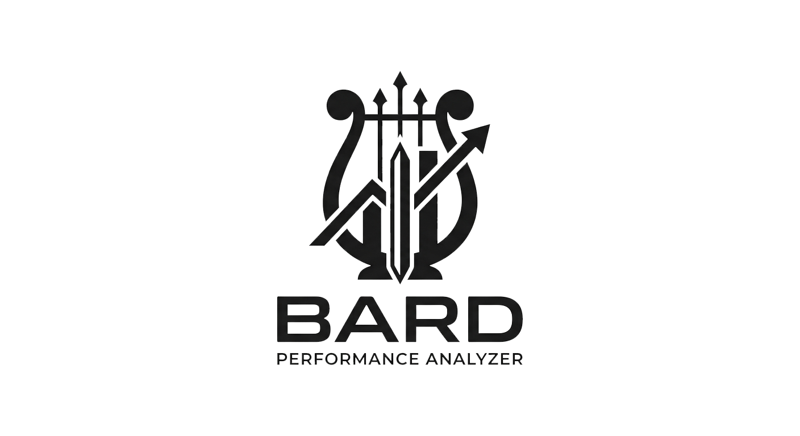

  <picture>
    <source media="(prefers-color-scheme: dark)" srcset="assets/bard_white.png" width="540">
    <source media="(prefers-color-scheme: light)" srcset="assets/bard_black.png" width="540">
    
  </picture>

Bard is an analyzer tool for players to check their performance based on combatlogs and give feedback on where they can improve.
